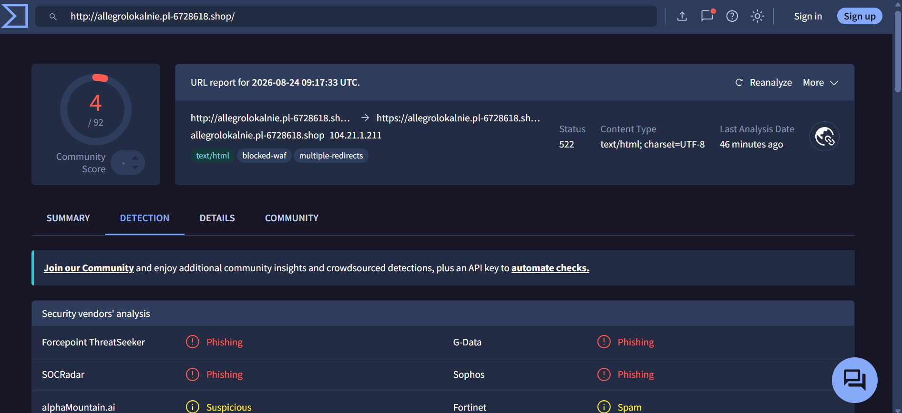
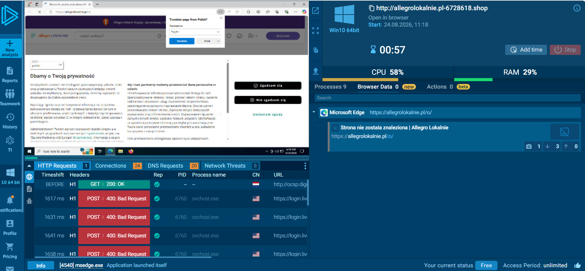
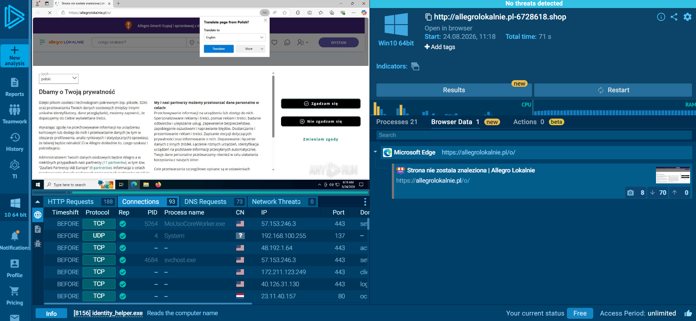

# SOC Lab: Phishing URL Investigation & Triage

## 1. Executive Summary
- Investigated a suspicious phishing URL (`http://allegrolokalnie.pl-6728618.shop`) associated with online shopping credential harvesting.
- Performed static reputation checks and dynamic sandbox detonation to analyze behavior, capture telemetry, and extract Indicators of Compromise (IOCs).

## 2. Tools & Environment
- **VirusTotal:** For initial static URL reputation scoring and threat intelligence lookup.
- **Any.Run:** For interactive dynamic sandbox analysis (Windows 10 64-bit environment) and network behavior monitoring.

## 3. Investigation & Analysis Phase

### Step A: Static Analysis (VirusTotal)
- Submitted the target URL to VirusTotal for initial evaluation.
- Multiple security vendors flagged the domain as **Phishing**, highlighting malicious indicators.
- **Evidence:**
  

### Step B: Dynamic Analysis & Sandbox Detonation (Any.Run)
- Detonated the URL inside an isolated Windows 10 sandbox to observe real-time behavior.
- The browser loaded a deceptive replica of the "Allegro Lokalnie" shopping platform designed to trick users into submitting private credentials.
- **Evidence:**
  

### Step C: Network & Traffic Analysis
- Inspected outbound network requests and connections during the sandbox execution.
- Identified active external connections and sessions established by the process.
- **Evidence:**
  

- **Live Sandbox Session:** [View Full Any.Run Public Task](https://app.any.run/tasks/5e64259e-9ae3-4faf-8d98-970eaa5e7e5b)

## 4. Extracted Indicators of Compromise (IOCs)
- **Target Phishing URL:** `http://allegrolokalnie.pl-6728618.shop`
- **Observed Network Endpoints / Connections:** Visible via Any.Run session telemetry.

## 5. Remediation & Recommendations
- **Perimeter Defense:** Add the malicious domain and associated infrastructure IPs to the organization's firewall and web proxy blocklists.
- **Email Security:** Update email gateway filters to block messages containing this specific phishing pattern.
- **User Awareness:** Conduct targeted phishing awareness training regarding lookalike domains (Typosquatting).
